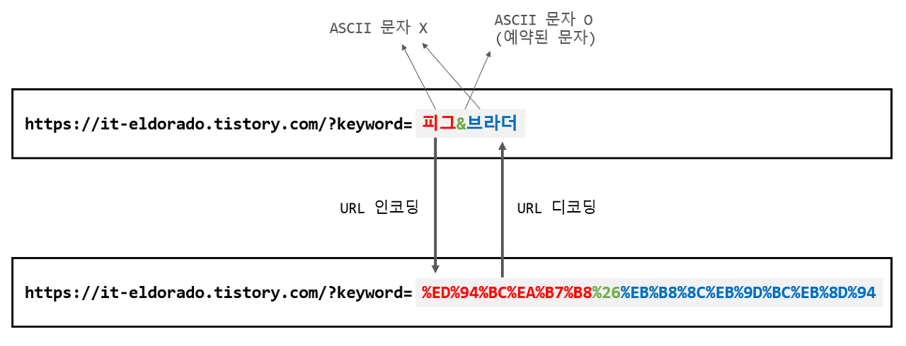
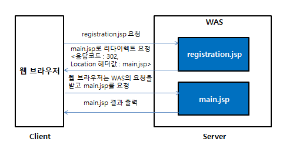
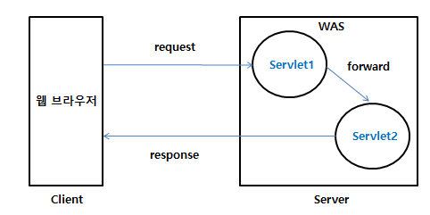
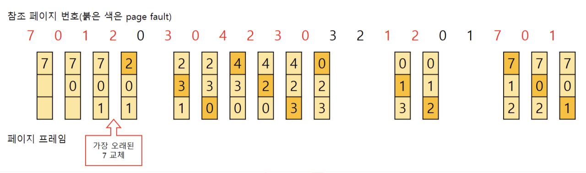
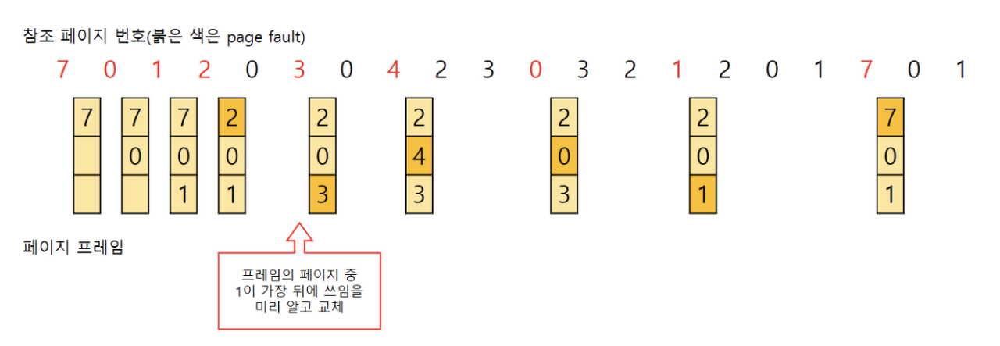
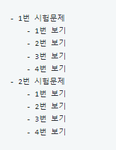

- homework

  - http method

    - 주어진 리소스에 수행하길 원하는 행동, 서버가 수행해야 할 동작을 지정
    - 종류

      - GET

        - 서버에 전달하고 싶은 데이터를 query(parameter, query string)을 통해 전달

        - 메시지 바디를 통해 데이터를 전달할 수도 있지만 지원하지 않는 곳도 존재하기 때문에 권장❌

      - POST

        - 메시지 바디를 통해 서버로 요청 데이터를 전달
        - 서버는 메시지 바디를 통해 들어온 데이터를 처리하는 모든 기능을 수행

        - 주로 신규 리소스의 등록, 프로세스 처리 등에 사용

        - 신규 리소스를 등록했다면 새로 생성되었다는 201 상태 코드와 생성된 URI 경로(Location)를 반환

        - 또한, 다른 메소드로 처리하기 애매한 경우 주로 사용
          -> 조회할 때 데이터를 넘기기 어려운 경우 데이터를 넘기는 데 사용할 수 있지만 조회는 GET을 사용하는 것이 좋다! POST는 캐싱하기 어렵기 때문...

      - PUT

        - 목적 리소스를 현재 메시지의 값으로 생성하거나 만약 존재한다면 기존 리소스를 삭제하고 덮어쓰기 실행
        - POST와 PUT은 어떻게 구분?
          - PUT은 POST와 다르게 클라이언트가 리소스의 위치를 알고 URI를 지정해 주어야 한다!
          - ex) PUT /members/100

      - PATCH

        - 리소스를 부분적으로 변경

      - DELETE
        - 특정 리소스의 삭제를 요청하는 데 사용

<br>

- http status code ex)500 , 400
  
- url 인코딩 디코딩

  - url 인코딩
    - URL에서 URL로 사용할 수 없는 문자 혹은 URL로 사용할 수 있지만 의미가 왜곡될 수 있는 문자들을 '%XX'의 형태로 변환하는 것
  - url 디코딩
    - 변환된 URL을 다시 원래의 형태로 되돌리는 것
      
  - URL 인코딩/디코딩은 왜 필요한 것일까?
    - 인터넷을 통해 전송할 수 있는 문자는 오로지 ASCII 문자이기 때문
    - ASCII 문자라 하더라도 예약된 의미를 가지고 있는 문자의 경우, 그 문자 자체의 의미를 전달하고 싶은 경우에는 이스케이프 처리가 필요
      - '&'는 쿼리 파라미터들을 구분해주는 역할
        -> 이러한 문자들을 문자 그 자체의 의미로서 전달하고 싶다면 이스케이프 처리가 필요
        -> '&'를 '%26'으로 인코딩

- redirect vs forward

  - redirect
    - 서버가 클라이언트에게 어떤 URL로 이동하라는 요청을 보내는 것
    - HTTP 프로토콜로 정해진 규칙
      
  - forward

    - 주로 Servlet으로 request 요청을 보내고 응답처리를 JSP로 데이터를 가공하여 만듬
    - 데이터를 처리하는 부분과 문서의 구조 부분을 분리하여 작성
    - WAS의 서블릿이나 JSP가 요청을 받은 후에 그 요청을 처리하다가 추가적인 처리를 같은 웹 어플리케이션 안에 있는 다른 서블릿이나 JSP에 위임하여 처리
      

  - redirect와 forward의 차이
    - redirect
      - 요청과 응답이 서로 다르게 각각 이루어짐
      - 처음 요청한 URL과 리다이렉트가 일어난 후의 URL이 다르게 변경됨
    - forward
      - 요청과 응답이 한번만 이루어짐
      - 요청 URL로 동작된 후에도 같다

- jpa vs mybatis

  - jpa
    > > > Java Persistence API의 약자로 Java ORM 기술에 대한 API 표준 명세를 말한다. JPA는 단순한 명세이기 때문에 JPA만 가지고는 어떤 구현 기술을 사용할 수 없다. 실제로 우리가 사용하는 Repository는 Spring Data JPA로 부터 제공되는 기술이다. Spring Data JPA는 JPA를 간편하게 사용하도록 만들어놓은 오픈 소스일 뿐이다.
  - mybatis
    > > > 사실상 MyBatis와 JPA는 비교 대상이 되지 않을 수 있다. 왜냐하면 JPA는 ORM 기술로 분류되고, MyBatis는 SQL Builder 또는 SQL Mapper의 한 종류이기 때문이다. MyBatis는 record에 원시 타입과 Map 인터페이스, 그리고 자바 POJO를 설정해서 매핑하기 위해 xml과 Annotation을 사용할 수 있다.
  - jpa vs mybatis
    > > > JPA는 만능이 아니다. 처음엔 사용하기 쉬울지 몰라도 점차 애플리케이션이 고도화된다면 오히려 더 손이 많이 가는 경우가 많다. 그렇기 때문에 JPA와 함께 문제점을 보완해 줄 수 있는 다른 라이브러리가 필요하다. 그 중에 하나가 Mybatis가 될 수 있다. 이 둘을 적절히 혼용하여 사용한다면 안정적인 서비스를 제공

- 페이지 교체 알고리즘(FIFO/OPT/LRU/LFU/MFU)

  - FIFO(First in First out) - 가장 먼저 들어온 페이지를 교체
    

    - 메모리에 가장 먼저 올라온 페이지를 먼저 내보냄.
    - 간단하고, 초기화 코드에 대해 적절한 방법
      들어온 시간을 저장하거나 올라온 순서를 큐에 저장.
    - 직관적으로 생각할 때 프레임의 수가 많아질수록 페이지 결함의 횟수는 감소함

  - OPT(Optimal) - 앞으로 가장 오랫동안 사용되지 않을 페이지 교체
    

    - 가장 이상적임
    - 프로세스가 앞으로 사용할 페이지를 미리 알아야 함 -> 불가능

  - LRU(Least Recently Used) - 가장 오랫동안 사용하지 않은 페이지를 교체
    

    - 가정: 가장 오랫동안 사용하지 않았던 데이터라면 앞으로도 사용할 확률이 적을 것이다.
    - 시간 지역성(temporal locality)성질 고려함.(최근에 참조된 페이지가 가까운 미래에 다시 참조될 가능성이 높은 성질)
    - 사용된 시간을 알수있는 부분을 저장하여 가장 오랫동안 참조되지 않는 데이터를 제거(페이지마다 카운터 필요)
    - 큐로 구현가능. 사용한 데이터를 큐에서 제거하여 맨 위로다시 올리고, 프레임이 모자랄 경우 맨 아래에 있는 데이터를 삭제
    - 단점: 프로세스가 주기억장치에 접근할때마다 참조된 페이지 시간을 기록해야 하므로 막대한 오버헤드가 발생

  - LFU(Least Frequently Used) - 참조 횟수가 가장 낮은 페이지를 교체

    - 페이지의 참조 횟수로 교체할 페이지 결정
    - LRU는 직전 참조된 시점만을 반영하지만, LFU는 참조횟수를 통해 장기적 시간규모에서의 참조성향 고려할 수 있음
    - 단점: 가장 최근에 불러온 페이지가 교체될 수 있음, 구현 더 복잡, 막대한 오버헤드

  - MFU(Most Frequently used) - 참조 횟수가 가장 많은 페이지 교체

    - 가정: 가장 많이 사용된 페이지가 앞으로는 사용되지 않을 것이다

- mybatis cache

  - local cache

    - 서버마다 캐시를 따로 저장
    - 다른 서버의 캐시를 참조하기 어렵
    - 서버 내에서 작동하기 때문에 속도가 빠름
    - 로컬 서버 장비의 Resource를 이용한다. (Memory, Disk)
    - 캐시에 저장된 데이터가 변경되는 경우:

      - 해당 서버를 제외한 모든 peer에 변경 사항 전달
      - All-to-All Replication
      - WAS 인스턴스가 늘어나고, 캐시 저장 데이터 크기가 커지면 성능이 저하되는 이유는 이 때문

      <br>

  - second level cache

- lombok 사용시 주의사항

  - @AllArgsConstructor, @RequiredArgsConstructor 의 사용 금지
    - 대신에 @Builder (파라미터를 순서가 아닌 인자 이름으로 인식)를 사용
  - @EqualsAndHashCode의 무분별한 사용 자제
  - @Data @Value 의 사용 금지
  - @Builder는 생성자나 static 객체 생성 메서드에 직접 바로 적용

- resultMap

  - MyBatis의 복잡한 결과 매핑을 간편하게 만들어주기 위해 만들어진 태그
  - 계층형 데이터 구조

    - 

    - 이러한 데이터를 가지고 sql문을 실행한 결과를 가지고 다음과 같은 같은 화면을 출력하고자 할때 resultmap을 사용

    - join을 이용해서 위의 화면을 출력하는 것은 가능은 하지만 어렵다. 조건들이 많이 등장할 것이며, 코드는 지저분하게 표시

- \# vs $ 차이점

  - #{}

    - 사용시 PreparedStatement를 생성
      들어오는 데이터를 문자열로 인식하기 때문에 자동으로 따옴표를 붙임
    - PreparedStatement 가 제공하는 set 계열의 메소드를 사용하여 물음표(?)를 대체할 값을 지정
      PreparedStatement 매개 변수 값 안전하게 설정
    - 평가: 반복적인 수행을 하는경우가 많기에 대부분의 경우에서 ${}방식보다 빠르다.
      - 또한 문자열에 자동으로 따옴표를 붙여주기 때문에 SQL Injection과 같은 보안상의 위협에 대비할 수 있음

  - ${}

    - 사용시 Statement를 생성

    - Statement 매개변수 값을 그대로 전달(= 문자열에 따옴표가 붙지 않음)

    - 평가: 매개변수값을 그대로 전달하기 때문에 문자열도 그대로 전달되므로 SQL Injection 같은 보안상의 위험요소가 존재
      - 또한 반복수행이 많은경우가 많아 일반적으로 #{}를 자주 접하지만 굳이..굳이.. 이걸 쓴다면 ORDER BY 함수를 사용할 때 자동으로 따옴표가 붙으면 함수가 동작하지 않기 때문에 ${}를 써야함

- connection pool

  - 왜 사용하는지

    - 서버의 부하를 줄여줌
      - Java에서는 DB Connection을 맺는 과정이 부하가 많이 걸리는 작업이라 동시에 많은 사람들이 DB 커넥션을 요구한다면 최악의 경우 서버가 죽어버리는 문제가 발생
      - 문제를 해결하기 위해 미리 Connection을 생성하고 재활용하여 서버에 부하를 줄여주는 용으로 사용
    - 서버의 한정적인 자원을 효율적으로 사용

      - 서버는 한정정인 자원을 가지고 있는데 요청이 올때마다 무제한의 Connection을 생성하게 된다면 전체 시스템에 성능에 문제가 생길 수 있음
      - 문제를 해결하기 위해 커넥션풀에 미리 정해진 숫자의 Connection을 생성해서 관리

      <br>

  - HikariPool는 무엇인지

    - HikariCP는 Database와의 커넥션 풀을 관리

    - JDBC커넥션을 맺는 과정은 상당히 복잡하고 자원을 많이 소모하는 작업이기 때문에 관리를 해야 성능적으로 좋음
    - 그런데 HikariCP는 미리 정해놓은 만큼에 커넥션은 pool에 담아 놓는다. 요청이 들어오면 Thread가 커넥션을 요청하고, Hikari는 Pool내에 있는 커넥션을 연결

- 객체 주입

  - 방식은 머가 잇는지

    - 생성자 주입
      - 생성자의 호출 시점에 1회 호출 되는 것이 보장
      - 주입받은 객체가 변하지 않거나, 반드시 객체의 주입이 필요한 경우에 강제하기 위해 사용
      - 생성자가 1개만 있을 경우에 @Autowired를 생략해도 주입이 가능

```java
@Service
public class UserService {

    private UserRepository userRepository;
    private MemberService memberService;

    @Autowired
    public UserService(UserRepository userRepository, MemberService memberService) {
        this.userRepository = userRepository;
        this.memberService = memberService;
    }

}
```

- 수정자 주입(Setter 주입)
  - 필드 값을 변경하는 Setter를 통해서 의존 관계를 주입하는 방법
  - 주입받는 객체가 변경될 가능성이 있는 경우에 사용

```java
@Service
public class UserService {

    private UserRepository userRepository;
    private MemberService memberService;

    @Autowired
    public void setUserRepository(UserRepository userRepository) {
        this.userRepository = userRepository;
    }

    @Autowired
    public void setMemberService(MemberService memberService) {
        this.memberService = memberService;
    }
}
```

- 필드 주입(Field Injection)

  - 필드에 바로 의존 관계를 주입하는 방법
  - 외부에서 접근이 불가능하다는 단점

```java
@Service
public class UserService {

    @Autowired
    private UserRepository userRepository;
    @Autowired
    private MemberService memberService;

}
```

- 왜 생성자 방식을 선호하는지

  - 최근에는 Spring을 포함한 DI 프레임워크의 대부분이 생성자 주입을 권장

  - 객체의 불변성 확보
    - 의존 관계의 변경이 필요한 상황은 거의 없음
    - 성자 주입을 통해 변경의 가능성을 배제하고 불변성을 보장
  - 테스트 코드의 작성

    - 순수한 자바 코드로 단위 테스트를 작성하는 것이 어렵
    - 컴파일 시점에 객체를 주입받아 테스트 코드를 작성
    - 주입하는 객체가 누락된 경우 컴파일 시점에 오류를 발견 가능

  - final 키워드 작성 및 Lombok과의 결합
    - 컴파일 시점에 누락된 의존성을 확인
    - final 키워드를 붙이면 Lombok과 결합되어 코드를 간결하게 작성 가능
  - 순환 참조 에러 방지
    - 애플리케이션 구동 시점(객체의 생성 시점)에 순환 참조 에러를 예방
